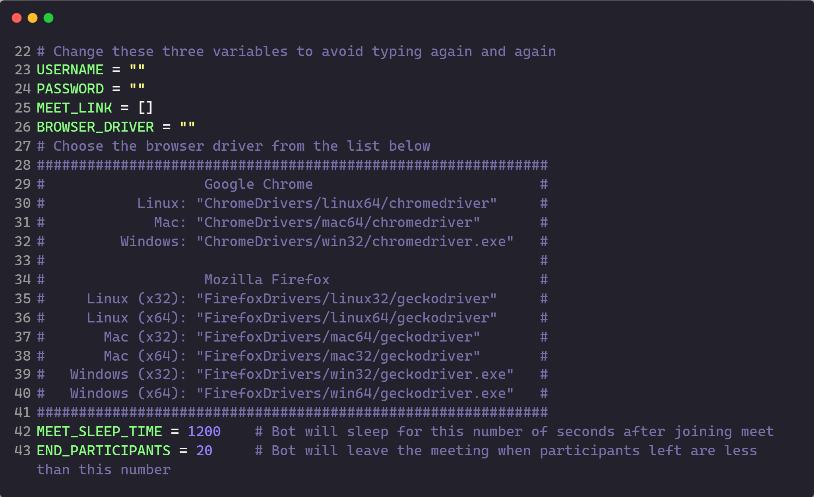

#

## Index

- [Index](#index)
- [Description](#description)
- [Features](#features)
- [How to use](#how-to-use)
- [Tips to use MeetGod Easily and Efficiently](#tips-to-use-meetgod-easily-and-efficiently)

## Description

A cross-platform super dope tool that attends Google Meet meetings for you while you are sleeping or doing some other work. MeetGod handles everything for you flawlessly


## Features

- Easy to use.
- Schedules the meetings and joins automatically on time.
- Sorts the meetings schedule with respect to time.
- You can add, remove, modify any meeting that is scheduled
- Has a user-friendly menu.
- Sleeps for a certain amount of time at the start of the meeting (20 mins by default).
- Leaves the meeting when the number of students are less than a particular value (20 by default).
- All the functions are performed on a seperate thread so you can interact with the bot even when it is in a meeting or waiting for one.
- Supported platforms: Windows, Mac and Linux.
- Supported Browsers: Google Chrome and Firefox.
- Automatically check for the MeetGod updates and notifies the user whenever an update is available.

## How to use

1. Clone this repository or download it as a .zip file (and extract its contents).
2. Install all the requirements by navigating into the MeetGod folder and running the following command in the terminal.

   ```
   pip install -r requirements.txt
   ```

3. Run the `Bot.py` file from the terminal using the following command and result will be taken care by the bot

   For windows users:

   ```
   python Bot.py
   ```

   For macos/linux users:

   ```
   python3 Bot.py
   ```

4. [Note] Make sure you have either Chrome or Firefox installed

## Tips to use MeetGod Easily and Efficiently

Even though everything will be taken care when the Bot.py is executed, still here are some variables that you can fill before running the Bot.py so that you don't have to type the details again and again when the bot is ran multiple time

1. Enter you username/email in the `USERNAME` variable on line 23
2. Enter your password in the `PASSWORD` variable on line 24
3. Enter the meet link and the time to join the meet(in 24 hour format) as one string in the list variable `MEET_LINK` on line 25. For example: `MEET_LINK = ["https://meet.google.com/uza-jkad-qwe 10:30:00", "https://meet.google.com/qwe-dsds-fio 16:00:00"]`
4. Choose the browser driver based on your system and browser and put it in the `BROWSER_DRIVER` variable on line 26 (Take help from the list given below the variable)


